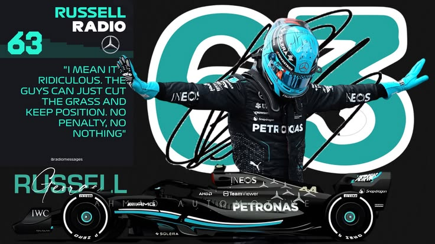

  

# `HI, I'M [KERL JAN]` 🏎️

**Precision under pressure. Built for speed. Driven by detail.**  
*(A Developer Profile Template Inspired by George Russell #63)*

---

## 🚦 THE QUALIFYING LAP (About Me)

> **"I mean it's ridiculous. The guys can just cut the grass and keep position. No penalty, no nothing."**  
> — *Me when other developers push straight to the main branch without code review.*

| | |
|---|---|
| 🏎️ **Current Team** | [Bukidnon State University] |
| 🌍 **Base** | [Malaybalay City, Philippines] |
| 🛠️ **Tech Stack** | [React, Node.js, Python, TypeScript, etc.] |
| 🎯 **Focus** | High-performance Systems, UI/UX, Clean Architecture |
| 🏁 **Latest Win** | [None] |

## 🛠️ THE MACHINE (Tools & Technologies)

| **FRONTEND** | **BACKEND** | **TOOLS** |
|:---:|:---:|:---:|
|  |  |  |
|  |  |  |
|  |  |  |

## 🏎️ PROJECTS PIT STOP

NetGame: A netacad game for people with ADHD
Project-X : PAD simulation system
Project-cY: Testing boundaries of AI
Escape: A game created for a OOP and Data Structure and Algorithm subject / Horror Game

### 🥇 Project One: "The W15"
A high-performance web application built with Next.js and TailwindCSS. 
- **Pace:** Reduced load time by 40%.
- **Tech:** React, TypeScript, GraphQL.
- [View Live](#) | [Source Code](#)

### 🥈 Project Two: "Telemetry Dashboard"
Real-time data visualization dashboard for tracking server metrics.
- **Pace:** Processes 10,000+ events per second.
- **Tech:** Python, WebSockets, D3.js.
- [View Live](#) | [Source Code](#)

---

### POLE POSITION MINDSET

**FAST IN DEVELOPMENT** &nbsp; • &nbsp; **CLEAN IN THE REPO** &nbsp; • &nbsp; **HUNGRY FOR DEPLOYMENT**

 

  

*Built for speed. Driven by detail.*

