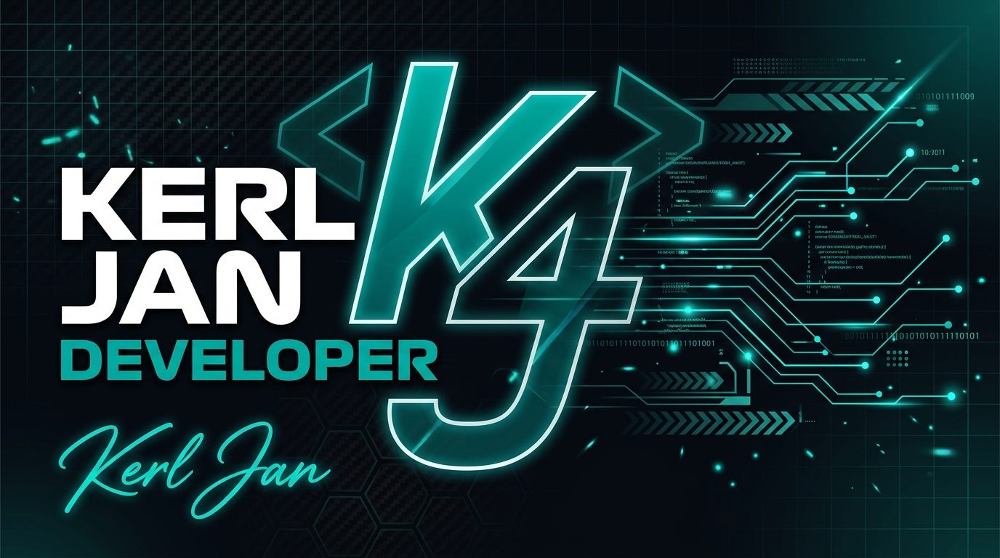
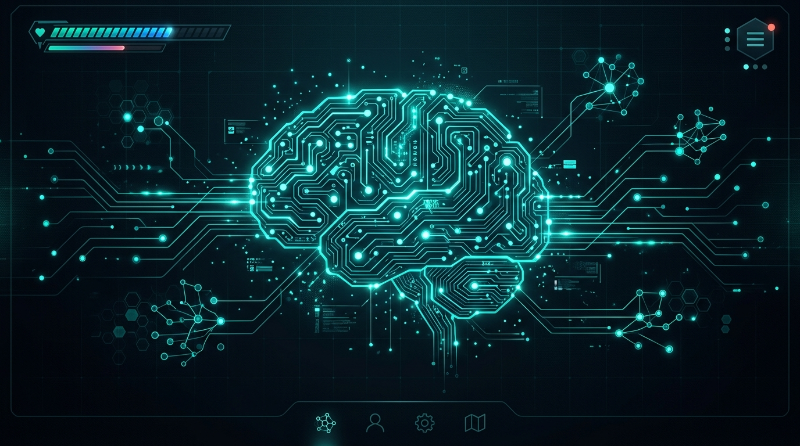
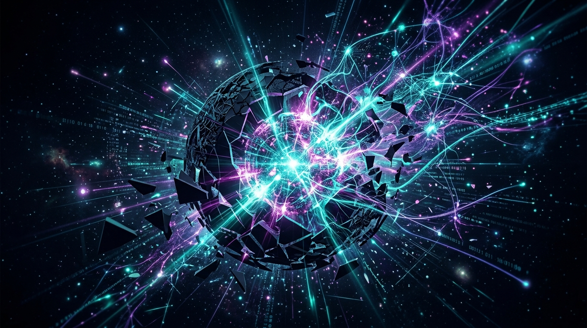
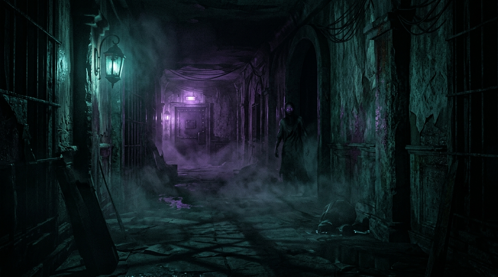
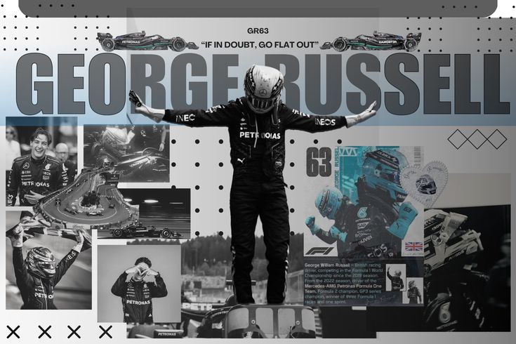

<div align="center">
  
</div>

<br>

<div align="center">

<!-- Social Badges -->
[](https://linkedin.com/in/kerljan)
[](https://github.com/kurljan)
[](https://buksu.edu.ph)
[](https://maps.google.com/?q=Malaybalay+City,+Philippines)

</div>

---

<div align="center">

```
╔══════════════════════════════════════════════════════════╗
║  "I mean it's ridiculous. The guys can just cut the      ║
║   grass and keep position. No penalty, no nothing."      ║
║                                        — Russell Radio   ║
╚══════════════════════════════════════════════════════════╝
```

*Me when someone ships code without testing it.*

</div>

---

## 🚦 QUALIFYING LAP — Who Am I?

> A developer from **Malaybalay City, Philippines**, studying at **Bukidnon State University**. I build games, simulations, and push AI to its limits. Currently in the early laps — learning fast, iterating faster.

<div align="center">

| | |
|:---|:---|
| 🏎️ &nbsp; **Team** | Bukidnon State University |
| 🌍 &nbsp; **Base** | Malaybalay City, Philippines |
| 🛠️ &nbsp; **Stack** | Python · Java · C++ · Web Technologies |
| 🎯 &nbsp; **Focus** | Game Dev · AI/ML · Simulation Systems |
| 🧠 &nbsp; **Driven by** | Curiosity, caffeine, and deadlines |
| 🏁 &nbsp; **Status** | Full throttle |

</div>

---

## 🛠️ THE MACHINE — Tech Stack

<div align="center">

| **LANGUAGES** | **FRONTEND** | **BACKEND & TOOLS** |
|:---:|:---:|:---:|
|  |  |  |
|  |  |  |
|  |  |  |

</div>

---

## 🏎️ PROJECTS PIT STOP

<br>

### 🥇 &nbsp; NetGame
**A Netacad-style learning game designed for people with ADHD**



> Built accessibility-first. NetGame gamifies learning concepts from Cisco Networking Academy (Netacad) with a pacing and engagement model tailored for players with ADHD — short bursts, clear feedback, rewarding loops.

[]()
[]()

---

### 🥈 &nbsp; Project-X
**PAD Simulation System**


> A simulation system for **Peripheral Artery Disease (PAD)**. Visualizes blood flow data, arterial blockages, and severity mapping — bridging clinical data and interactive simulation for educational and diagnostic purposes.

[]()
[]()

---

### 🥉 &nbsp; Project-cY
**Testing the Boundaries of AI**



> An experimental project pushing what AI can and cannot do. Stress-testing model capabilities, exploring edge cases, and documenting where intelligence — artificial or otherwise — breaks down.

[]()
[]()

---

### 🎮 &nbsp; Escape
**A Horror Game built for OOP & DSA**



> A horror escape game created as a project for **Object-Oriented Programming** and **Data Structures & Algorithms** subjects. Navigate terrifying environments while the game engine underneath runs on clean OOP architecture and DSA-powered logic.

[]()
[]()

---

## 📊 TELEMETRY — GitHub Stats

<div align="center">


&nbsp;


</div>

<div align="center">


</div>

---

<div align="center">

### POLE POSITION MINDSET

**FAST IN DEVELOPMENT** &nbsp;•&nbsp; **CLEAN IN THE REPO** &nbsp;•&nbsp; **HUNGRY FOR DEPLOYMENT**

<br>

[](https://linkedin.com/in/kerljan)
[](https://github.com/kurljan)

<br>



<br><br>

*Built for speed. Driven by detail.*

---

*Kerl Jan · Malaybalay City, Philippines · Bukidnon State University*

</div>

